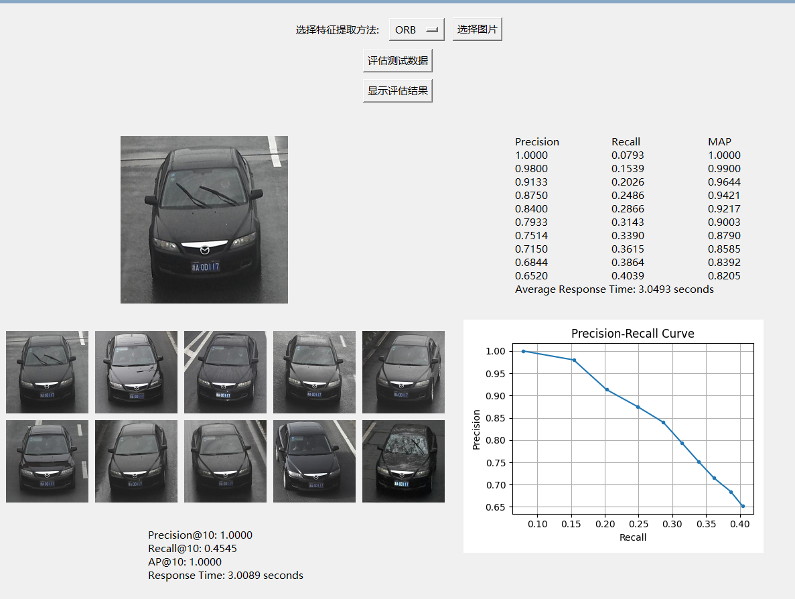
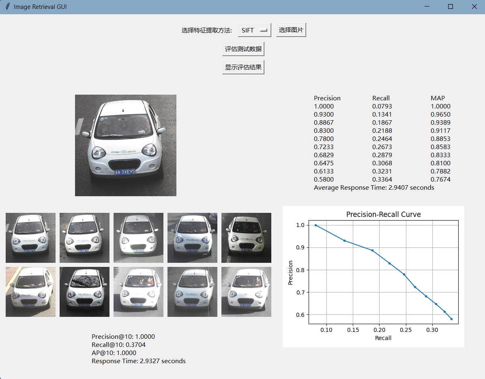

# Computer_Vision_Project

## 项目介绍

这是一个用于图像特征提取、聚类、分类和检索的 Python 项目。

这个项目包含一系列用于图像特征提取、聚类、分类和检索的 Python 脚本。每个脚本实现了不同的功能，具体如下：

## 目录

- [Computer\_Vision\_Project](#computer_vision_project)
  - [项目介绍](#项目介绍)
  - [目录](#目录)
  - [安装](#安装)
    - [硬件环境配置](#硬件环境配置)
    - [开发环境](#开发环境)
    - [前提条件](#前提条件)
    - [步骤](#步骤)
  - [使用](#使用)
  - [脚本描述](#脚本描述)
    - [image\_feature\_clustering.py](#image_feature_clusteringpy)
    - [image\_classification\_with\_cnn.py](#image_classification_with_cnnpy)
    - [bof\_encoding.py](#bof_encodingpy)
    - [gui.py](#guipy)
    - [image\_retrieval\_evaluation.py](#image_retrieval_evaluationpy)
  - [CNN模型记录](#cnn模型记录)
  - [结果示例](#结果示例)
    - [ORB](#orb)
    - [SIFT](#sift)

## 安装

说明如何安装和配置项目的依赖。
### 硬件环境配置

- CPU：AMD Ryzen 7 5800H with Radeon Graphics
- 内存：16GB (3200 MHz)
- 存储：512GB 固态硬盘
- 显卡：NVIDIA GeForce RTX3060 Laptop GPU

### 开发环境

- 操作系统：Windows
- 集成开发环境（IDE）：PyCharm
- 虚拟环境管理工具：Anaconda

### 前提条件

列出项目运行所需的前提条件：

- Python 版本 3.8 或更高
- TensorFlow 和 Keras
- OpenCV
- Scikit-learn
- Tkinter
- numpy
- matplotlib
- pillow
- logging
- datetime
- os
- glob
- json
- pickle

### 步骤

详细的安装步骤：

```bash
git clone https://github.com/Cizone7/Computer_Vision.git
cd Computer_Vision
```

## 使用

说明如何使用项目的功能。


## 脚本描述

详细描述每个脚本的功能、输入参数和输出结果。

### image_feature_clustering.py
使用 ORB 和 SIFT 算法从图像中提取特征，使用 K-means 算法对特征进行聚类，再用码本计算 TF-IDF 中的 DF 值，得到一个长度为 K-means 聚类数的列表，最终将 DF 模型和 K-means 模型保存。

### image_classification_with_cnn.py
使用 TensorFlow 和 Keras 库创建并训练一个用于图像分类的卷积神经网络（CNN）。它自动从指定目录加载图像，执行数据预处理和标准化，然后构建并训练 CNN 模型。模型结构包括多个卷积层、池化层、全连接层，并采用 L2 正则化和 Dropout 来防止过拟合。训练过程中，TensorBoard 用于监控，而 EarlyStopping 用于避免过拟合。最终，训练好的模型将保存为 HDF5 文件，以便后续使用。

### bof_encoding.py
使用 ORB 和 SIFT 算法从图像中提取特征，再接着使用一个预先计算好的"码本"（codebook），将提取的特征编码成固定长度的向量。这里的编码方法涉及到 TF-IDF（Term Frequency-Inverse Document Frequency）权重，用于表示每个特征的重要程度。最后将编码后的特征保存到文件中。

### gui.py
使用 Tkinter 库创建一个窗口，并设置了一些按钮、标签和画布来构建用户界面。用户可以选择特征提取方法、选择图像文件，以及触发评估测试数据等操作。当用户选择图像文件后，程序会使用选择的特征提取方法从图像中提取特征。然后，利用预先训练好的模型和码本对提取的特征进行编码，并使用 KNN 算法进行相似图像的搜索。搜索结果将显示在 GUI 界面上，展示出与查询图像最相似的几幅图像。

用户可以点击按钮来触发评估测试数据的操作。该操作会在一个新线程中执行，加载测试数据集，并对其进行评估，包括计算精度、召回率、平均响应时间等指标。评估结果会显示在 GUI 界面上，同时绘制出 Precision-Recall 曲线，以可视化展示性能。

其中图形函数都是从 image_retrieval_process.py 里导入。

### image_retrieval_evaluation.py
它遍历测试数据集中的每张图像，提取特征并对其进行编码，然后利用查询算法，包括 KNN、CNN 重排序和扩展查询搜索相似图像。最后，根据搜索结果和实际标签，计算精度、召回率等指标，并返回评估结果。

## CNN模型记录
CNN_20240528-185954.h5  监察val-accuracy patience=5 epoch =40
CNN_20240528-190454.h5  监察val-loss  patience=5 epoch =40

CNN_20240528-190454.h5 效果好 precision=0.7833

CNN_20240528-193503.h5 监察val-loss  patience=10 epoch =80 precision=0.7667

数据增强 监察val-loss  patience=5 epoch =100

## 结果示例
### ORB

### SIFT
